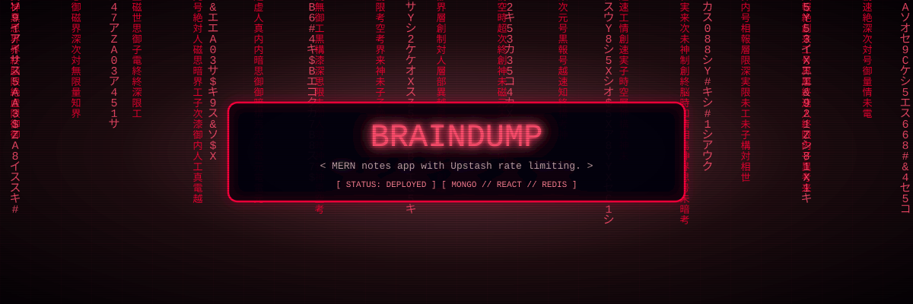

<div align="center">
  
</div>

# BrainDump — MERN Notes App

A full-stack notes app: Express + MongoDB API with Upstash Redis rate
limiting, React 19 + Vite + Tailwind/daisyUI frontend. Create, view, and
delete notes; the API throttles abusers with a dedicated rate-limited UI.

Live: https://brain-dump-qn0o.onrender.com/
(free Render tier — first load can take ~1 minute while it wakes up)

## Stack

- **Backend** (`backend/`, ESM): Express 4, Mongoose 7, `dotenv`,
  Upstash Redis + `@upstash/ratelimit`, CORS. `nodemon` for dev.
- **Frontend** (`frontend/`, Vite 7): React 19, react-router, axios,
  react-hot-toast, lucide-react, Tailwind 3 + daisyUI.
- Root `package.json` wires both: `npm run build` installs deps + builds the
  frontend, `npm run start` runs the backend (which serves the API under
  `/api/notes`).

## Structure

```
backend/src/
  server.js          express app, mounts /api/notes
  routes/            notesRoutes.js
  controllers/       notesController.js (CRUD)
  models/            Note.js (mongoose schema)
  middleware/        rateLimiter.js (upstash)
  config/            db.js (mongo), upstash.js (redis)
frontend/src/
  pages/             HomePage, CreatePage, NoteDetailPage
  components/        Navbar, NoteCard, NotesNotFound, RateLimitedUI, footer
  lib/               axios.js (API client), utils.js
```

## Run locally

```sh
# 1. configure env (see backend/.env.example — never commit real values)
cp backend/.env.example backend/.env
# then fill in your own MONGO_URI / Upstash credentials

# 2. install + dev (two terminals)
npm install --prefix backend && npm run dev --prefix backend
npm install --prefix frontend && npm run dev --prefix frontend
```

Or from the root: `npm run build` then `npm start`.

## Env vars (`backend/.env`)

| Var | Purpose |
|---|---|
| `MONGO_URI` | MongoDB connection string |
| `PORT` | API port (e.g. `5001`) |
| `UPSTASH_REDIS_REST_URL` | Upstash Redis REST endpoint |
| `UPSTASH_REDIS_REST_TOKEN` | Upstash Redis REST token |
| `NODE_ENV` | `development` / `production` |

## Security note

`backend/node_modules/` and `backend/.env` were once committed by accident
and have been purged from history. If you ever committed real credentials,
**rotate them** (MongoDB password, Upstash token) — purging history does not
un-leak them. `.gitignore` already excludes both paths going forward.
